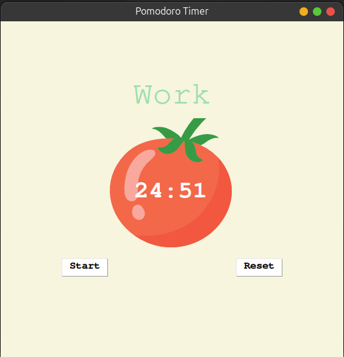
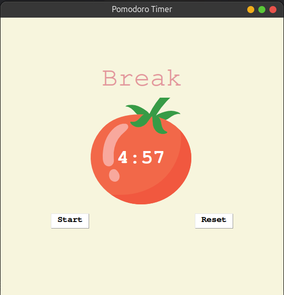
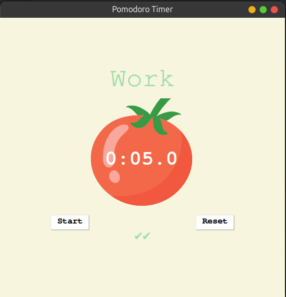

# Pomodoro Timer Application ⏲️🍅
This Python application is designed to help users implement the Pomodoro Technique, a time management method that encourages focused work sessions followed by short breaks. The application features a simple and intuitive user interface built with Tkinter, making it easy to use and effective for enhancing productivity.

## What is the Pomodoro Technique?
The Pomodoro Technique is a time management method developed by Francesco Cirillo in the late 1980s. It involves breaking work into intervals, traditionally 25 minutes in length, separated by short breaks. After completing four intervals, or "Pomodoros," a longer break is taken. This technique is known for improving focus and preventing burnout.

### Key Features:
- Pomodoro Timer: Set and track 25-minute work sessions followed by short breaks.
- User Interface: A clean and simple UI built with Tkinter for easy interaction.

Technology Stack:
✅ Python | Tkinter

